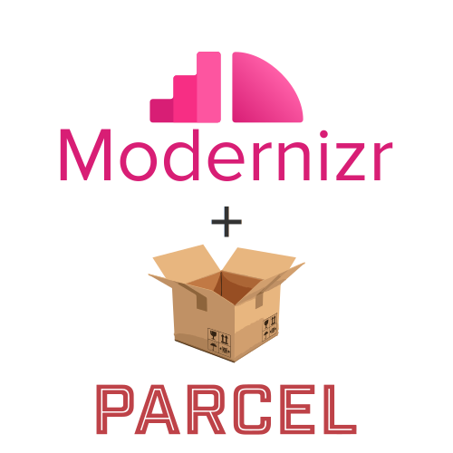

# parcel-resolver-modernizr <small>0.0.3</small>

> A [Parcel 2.0](https://github.com/parcel-bundler/parcel) resolver for custom [Modernizr](https://github.com/Modernizr/Modernizr) builds

[GitHub](https://github.com/PabloNicolasDiaz/parcel-resolver-modernizr)
[Getting Started](#parcel-resolver-modernizr)
